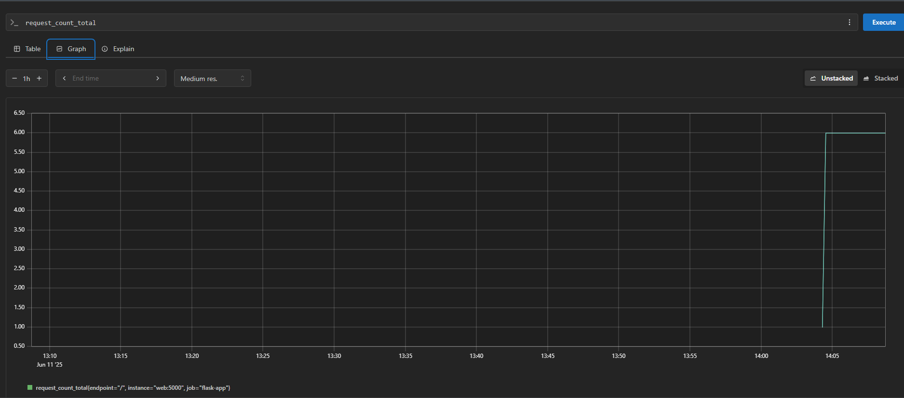
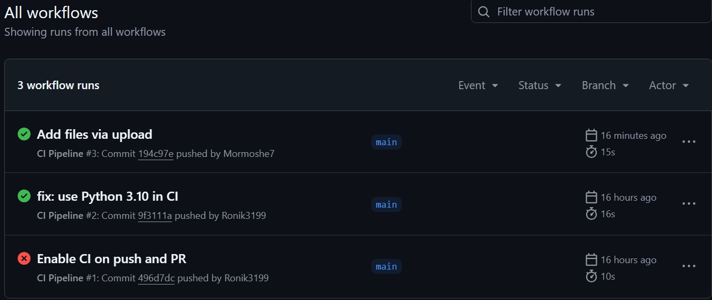
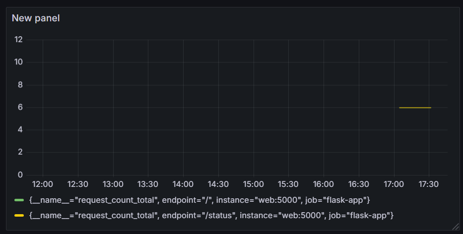

# Flask CI/CD Monitoring App

##  Project Overview

This project demonstrates a full CI/CD pipeline for a Python Flask web application using GitHub Actions, Docker, Prometheus, and Grafana. The application is instrumented with custom metrics and deployed via Docker Compose in a monitored environment.

---

##  Architecture Overview

- **Flask Backend**: Exposes API endpoints with metrics for monitoring.
- **GitHub Actions**: Handles CI/CD pipeline including linting, testing, Docker build, push, and deployment.
- **Prometheus**: Scrapes metrics from Flask app and system exporter.
- **Grafana**: Visualizes metrics with a custom dashboard.
- **Docker Compose**: Orchestrates all services locally.

---

##  API Endpoints

| Method | Route         | Description             |
|--------|---------------|-------------------------|
| GET    | `/hello`      | Returns "Hello, World!" |
| GET    | `/metrics`    | Prometheus metrics      |
| GET    | `/cicd-test` *(commented)* | CI/CD demo endpoint |

---

##  CI/CD Workflow

###  CI (on pull request):

- Checkout code
- Install dependencies
- Lint code
- Run unit tests (`test_app.py`)
- Build Docker image

###  CD (on push to main):

- Build Docker image
- Push to Docker Hub
- Deploy using Docker Compose (optional step for Render or similar)

 CI/CD Metrics Example (Prometheus):



---

##  Monitoring & Observability

### Prometheus
- Scrapes metrics from:
  - Flask app (`/metrics`)
  - Node-exporter
  - Grafana

### Grafana
- Uses pre-configured dashboard stored in `/grafana/provisioning/dashboards/dashboard.json`
- To import:
  - Login to Grafana (`http://localhost:3000`)
  - Default user: `admin / admin`
  - Import dashboard from JSON

---

##  Docker & Compose

To run everything locally:

```bash
docker-compose up --build
```

This launches:
- Flask App on port `5000`
- Prometheus on `9090`
- Grafana on `3000`
- Node Exporter on `9100`

---

##  Docker Hub

The built Docker image is pushed to Docker Hub:  
[Docker Hub Repo](https://hub.docker.com/r/mormoshe7/flask-cicd-app)

---

##  Deployment

The app is deployed to Render.

**Live App Link**: https://flask-cicd-app-6gzn.onrender.com

---

##  Setup Instructions

1. Clone the repo
2. Set up `.env` if needed
3. Run `docker-compose up`
4. Access:
   - App: http://localhost:5000
   - Prometheus: http://localhost:9090
   - Grafana: http://localhost:3000

---

##  Team Info

- Name: Shay Shalev  
  ID: 211783519  
- Name: Adi Matok  
  ID: 212917926  
- Name: Roni Lubashevski  
  ID: 318917556  
- Name: Mor Moshe  
  ID: 323915363  
- GitHub: [https://github.com/Ronik3199/flask_cicd_app](https://github.com/Ronik3199/flask_cicd_app)

---

##  Screenshots



_Grafana Dashboard screenshot not available yet_

---

##  License

MIT
